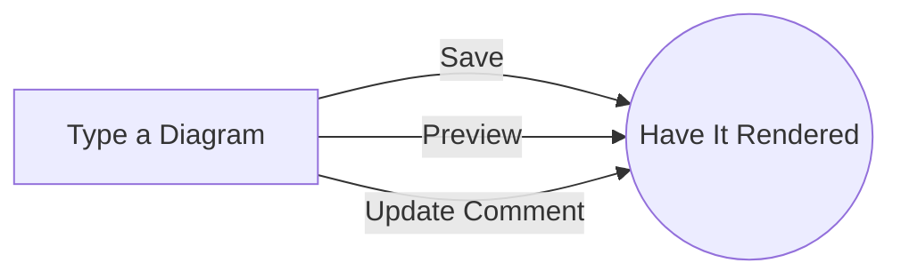

# redmine_render_mermaid

Redmine Render Mermaid plugin.

~~~~

~~~~

## Features

* Renders mermaid from code blocks marked as `mermaid`. Works with both Textile and Markdown.
* Compatible with GitLab: Markdown with Mermaid diagrams can be shared between Redmine and Gitlab with the same meaning.
* Does not mess up the HTML: Mermaid is rendered dynamically on top of DOM.
* Page load speed: the Mermaid library is only loaded when there is any diagram on the page.

To be done:
* Add macro as an alternative to mermaid code blocks.

## Requirements

* Redmine 4.2
* Patch from https://redmine.org/issues/35104 or Redmine from [redmine-gfm image](https://hub.docker.com/r/orchitech/redmine-gfm).

## Testing

Try all of the following in two scenarios:
* when there is no prior diagram
* when there is already a diagram present

When updating a diagram, check that the rendered version is the updated one.

Test cases:
* Insert a Mermaid diagram in a wiki page, save, it should be rendered.
* A Mermaid diagram should be rendered in editor's preview:
  * in a wiki page,
  * when editing an existing issue comment.
* Edit issue comment, insert a Mermaid diagram, save, it should be rendered.
